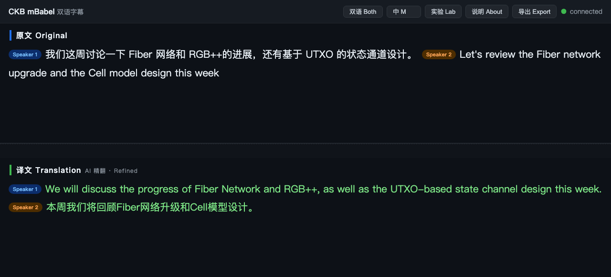

# CKB mBabel

[English version](README.md)

中英双语会议实时字幕。听会、转写、翻译,浏览器双栏展示,带说话人标签、领域热词和一键 Markdown 导出。为中英混合团队解决"一半人听不懂另一半人说话"的问题。

本地不存音频,音频由火山引擎云端 API 处理。

**在线演示:** https://kydchen.github.io/CKB_mBabel/ —— 一场双语站会的脚本重演,所有控件可点,无需任何配置。



## 功能

- **双向一条流**:中文发言出英文字幕,英文发言出中文字幕,语种判断和中英混说按句子处理。
- **三段式翻译,覆盖率守卫**:≈ 快速翻译跟着说话实时更新;句子落定时,只有草稿源文覆盖最终句至少 60% 才晋升为临时字幕,否则直接等待带上下文的精翻,避免先显示误导性的残句。
- **说话人标签**:服务端说话人聚类,说话人名字排在页边,导出时命名会实时更新到页面。
- **免训练的领域适配**:ASR 热词(直传加自学习词表双通道)、客户端纠错词表、逐句强制的翻译术语表。
- **会中即时纠错(仅主持人)**:实验面板输入 `错词=正确词`,后续句子即时生效,退出时写回术语表,下次开会自动带着。
- **观众端偏好**:每个浏览器自选语言视图(双语/只看中文/只看英文)、四档字号含投屏模式;字幕只在贴底时自动跟随,上翻回看不被打断,一键"回到最新"。
- **可分享,观众只读**:局域网链接开箱即用;装了 cloudflared 一键出公网链接(无需账号)。管控操作需要主持人令牌,局域网和公网观众都拿不到。
- **可导出**:Markdown 或带时间轴的 SRT 字幕,原文/译文/双语对照,说话人名字浏览器本地记忆。
- **长会稳健性**:ASR 断线自动退避重连,限流单独分类退避、失败句静默补译,语种误识句带「识别存疑」标记,全场转录自动落盘(JSONL + Markdown),不依赖浏览器。

## 架构

```
麦克风/系统声音(macOS: BlackHole + 聚合设备)
  → 火山 Seed-ASR 2.0(流式、二遍识别、热词、说话人聚类)
  → 句子累积器(语言边界切分、静音看门狗)
  → 快速草稿:火山机器翻译(matx_translate,原生术语表)
  → 落定瞬间:覆盖充分的草稿晋升,随后被带上下文的精翻覆盖
    (方舟 Doubao Seed mini,携带前文)
  → 本地网页 UI(单端口:HTTP 页面 + WebSocket 推送)
```

一把火山语音控制台 API Key 覆盖识别和快速草稿;可选的方舟 Key 启用带上下文的精翻(推荐)。延迟:中间结果 1 秒内;草稿覆盖率达到 60% 时句子落定即有临时译文,否则约两秒后直接显示精翻。

## 成本

价格为 2026-08 时点,使用前以控制台为准。

| 方案 | 识别 | 翻译 | 每小时合计 |
|---|---|---|---|
| **Babel(火山)** | Seed-ASR 2.0:后付费 ¥3.5/小时($0.49);资源包 ¥28/30 小时($3.9),折合 ¥0.93/小时($0.13) | 机器翻译大模型:¥1.62/百万 token($0.23,资源包);一会议小时远低于 10 万 token | **约 ¥3.5/小时($0.49);买包约 ¥0.5/小时($0.07)** |
| 讯飞同传 LLM 档 | — | — | ¥40.8/小时($5.7),¥4080($570)/100 小时 |
| Google 自建 | Cloud STT Chirp $0.016/分钟 ≈ $0.96/小时(¥6.8) | Cloud Translation $20/百万字符 ≈ $0.2/小时(¥1.4) | 约 $1.2/小时(¥8.5),且国内需自行解决网络 |

Babel 比讯飞同传 LLM 档便宜约 12 倍,模型更新;比 Google 自建便宜约 2.5 倍。

## 配置

### 1. 火山引擎(一把 API Key)

1. 打开语音技术控制台:`console.volcengine.com/speech`。
2. 开通**豆包流式语音识别模型 2.0**(小时版,资源 `volc.seedasr.sauc.duration`)和**机器翻译大模型**(资源 `volc.speech.mt`)。
3. 在控制台 API Key 管理里创建 API Key。
4. 复制 `.env.example` 为 `.env`,填入 `VOLC_ASR_API_KEY`;建议再填 `ARK_API_KEY`(console.volcengine.com/ark)启用带上下文的精翻,不填则精翻回落到与草稿相同的机器翻译。

可选:热词超过直传 100 token 上限时,在自学习平台 → 热词管理上传 `hotwords/boosting_table.txt`,把词表 ID 填进 `.env` 的 `VOLC_BOOSTING_TABLE_ID`。

### 2. 安装

```bash
cd solution
python3 -m venv .venv
.venv/bin/pip install -r requirements.txt   # PyPI 慢加镜像 -i https://pypi.tuna.tsinghua.edu.cn/simple
```

### 3. 音频路由(macOS)

- 线下会议:无需配置,直接用 MacBook 麦克风。
- 线上会议(Zoom/Teams/Meet):`brew install blackhole-2ch`,在音频 MIDI 设置里建:
  - **多输出设备**:扬声器 + BlackHole 2ch(你听得到,Babel 拿一份);
  - **聚合设备**:BlackHole 2ch + 你的麦克风(远端声音加你自己的声音)。
- 会议软件输出选多输出设备。

### 4. 运行

```bash
cd solution
.venv/bin/python main.py --list-devices                       # 查设备序号
.venv/bin/python main.py --device <聚合设备序号> --channels 4
# 或者直接用默认麦克风:
.venv/bin/python main.py
```

浏览器自动打开字幕页。常用参数:

- `--share`:打印局域网链接;装了 cloudflared(`brew install cloudflared`)自动打印公网链接,页面右上角"分享 Share"按钮可直接复制;页面挂在随机 token 路径下。
- `--translator {volc-mt,ark,qwen-mt}`:翻译后端,默认 volc-mt。
- `--end-window 600`:判停静音毫秒数。
- `--port 8899`:字幕页端口(默认 8765),可双实例并行。
- `--wav test.wav`:用 16kHz 单声道 WAV 回放测试(仓库自带样例)。
- `--no-ui`:只用终端输出。

双击启动:编辑 `Babel.command` 里的设备序号后,Finder 双击即可。

## 领域适配

- `hotwords/hotwords.txt`、`hotwords/hotwords_zh.txt`:ASR 热词,每行一个。英文专名同时作为恒等术语进翻译侧(原样保留)。
- `solution/glossary.json`:`terms` 是中英术语对(英译中译值建议用"Fiber网络"这种中英混合形态;匹配大小写敏感,程序自动生成变体);`corrections` 是识别纠错映射。
- `hotwords/boosting_table.txt`:每次启动重新生成(平台规则:小于 10 字、无标点、数字写汉字),词表变更后重新上传。

仓库自带的词表面向 Nervos CKB 区块链生态(挖掘自社区 Telegram 和 Nervos Talk 论坛),换成你自己领域的词即可。

## 说明与限制

- 说话人标签是聚类编号(说话人 1/2/…),会议内稳定,不是实名。
- 音频经云端处理,有全离线需求的场合这套方案不适用。
- 暂无暂停按钮:服务端约 8 秒空闲即断连,真暂停需要与重连逻辑联动(已规划)。
- 转录自动保存在 `solution/transcripts/`(运行时创建,不入库)。
- 在 macOS(Apple Silicon)上实测;音频采集层理论跨平台,路由说明是 macOS 专属。

## License

MIT
